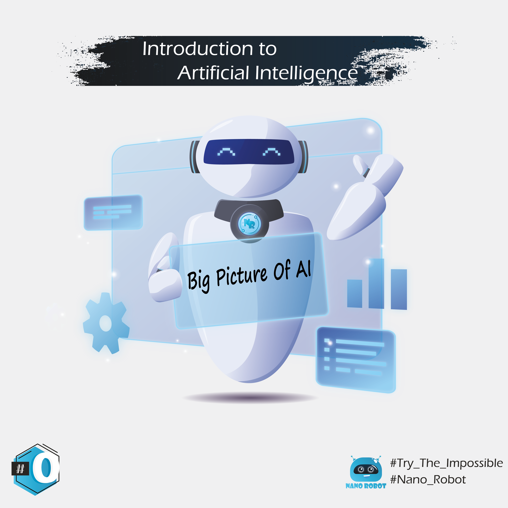

the concept #09, is an idea in which I try to give a simplified explanation of the concepts of artificial intelligence and machine learning, in a somewhat superficial way, in order to simplify the notions. The division will be as follows:

[## 01#Big_Data](https://miliari.me/blog/2020/AI-ML-DL/01-big-data/big-data/)
[## 02#History](https://miliari.me/blog/2020/AI-ML-DL/02-history-of-ai/histroy-ai/) 
[## 03#AI_ML_DL](https://miliari.me/blog/2020/AI-ML-DL/03-AI-ML-DL/AI-ML-DL/) 
[## 04#AI](https://miliari.me/blog/2020/AI-ML-DL/04-AI/AI/)  
[## 05#Machine_Learning](https://miliari.me/blog/2020/AI-ML-DL/05-Machine-Learning/ML/)
[## 06#Deep_learning(Neural_Network)](https://miliari.me/blog/2020/AI-ML-DL/06-Deep-Learning/DL/)
[## 07#Narrow_AI](https://miliari.me/blog/2020/AI-ML-DL/07-Narrow-AI/Narrow-AI/)
[## 08#AGI](https://miliari.me/blog/2020/AI-ML-DL/08-AGI/AGI/)
[## 09#ASI](https://miliari.me/blog/2020/AI-ML-DL/09-ASI/ASI/)

🚨 n.b : In case you preffer to read same slides in Darija (I recommand to try the experience with darija), just check it in the link below :

https://www.instagram.com/nanorobot_ma/ 