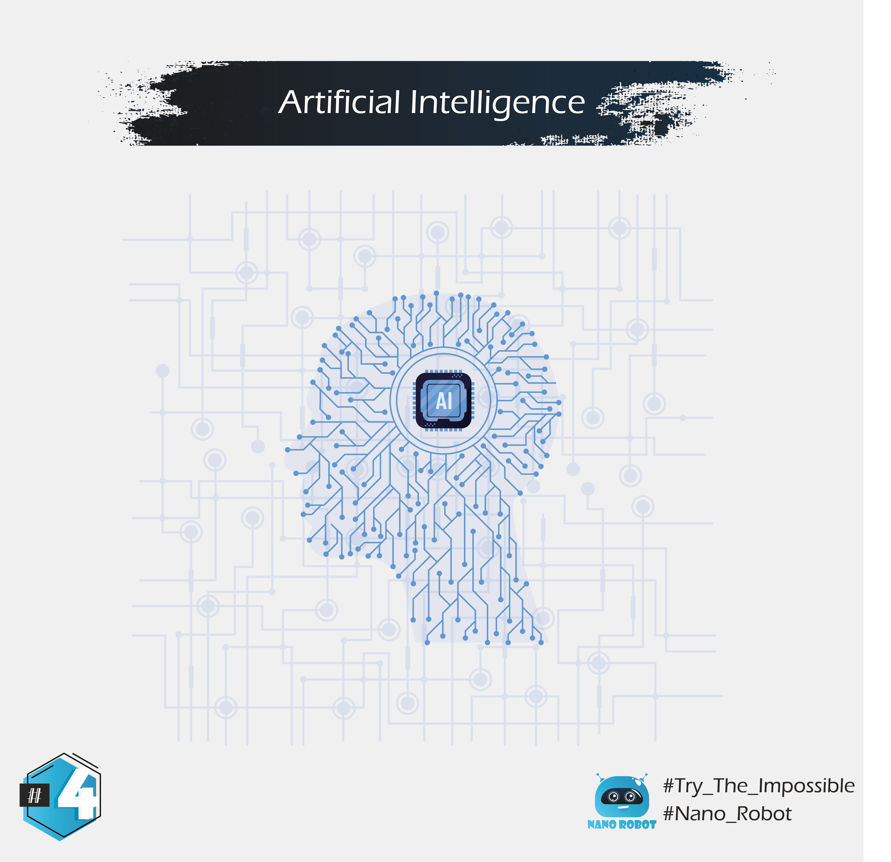

In basic terms, AI is a broad area of computer science that makes machines seem like they have human intelligence.
So it’s not only programming a computer to drive a car by obeying traffic signals, but it’s when that program also learns to exhibit signs of human-like road rage.
So When we talk about intelligence, we're referring to the ability of gathering, processing and then applying knowledge.