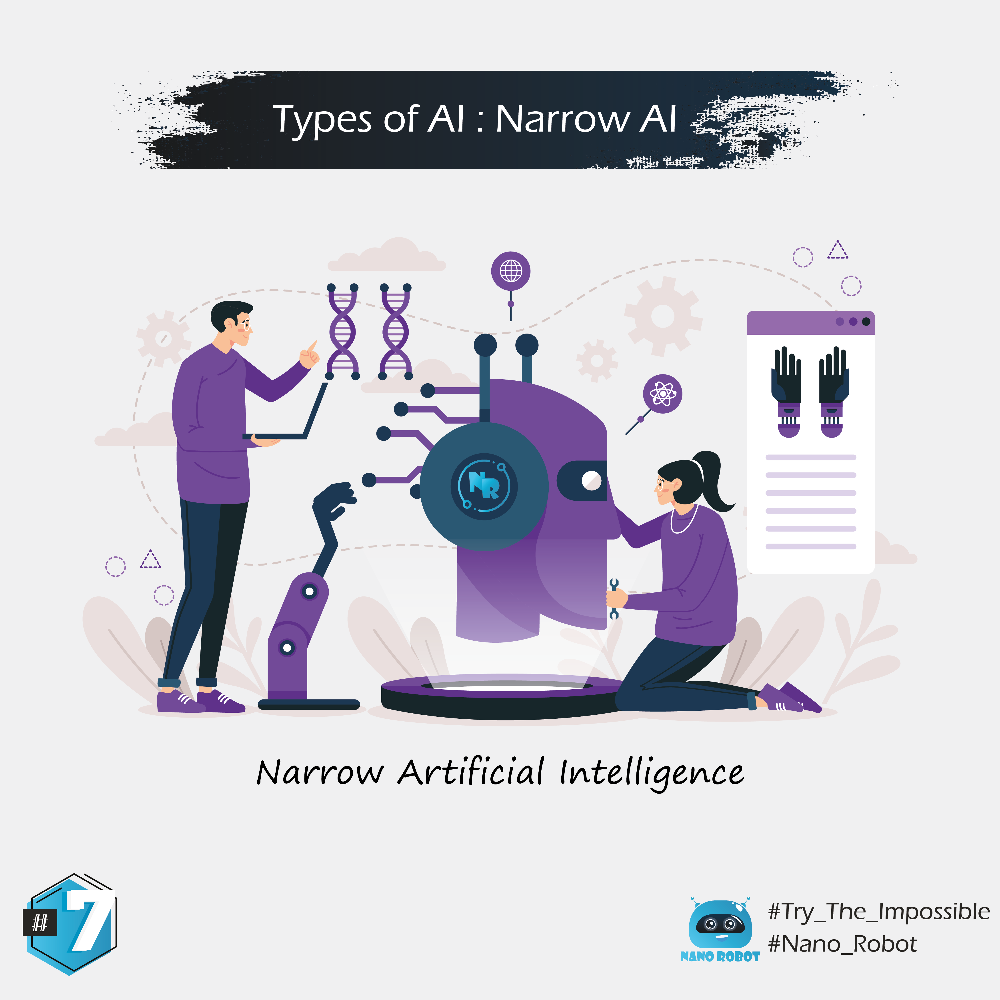

The first and most basic form of AI is ANI, or artificial narrow intelligence.
It's called narrow because it can only perform tasks in specific, predefined contexts.
Narrow AI can do a task it was programmed to do incredibly well.
But it gets confused if you present it with new tasks that weren't previously defined and programmed.
Just because narrow AI is limited, doesn't mean it's not useful. Many companies use ANI chatbots for customer service. Some AIs are writers.