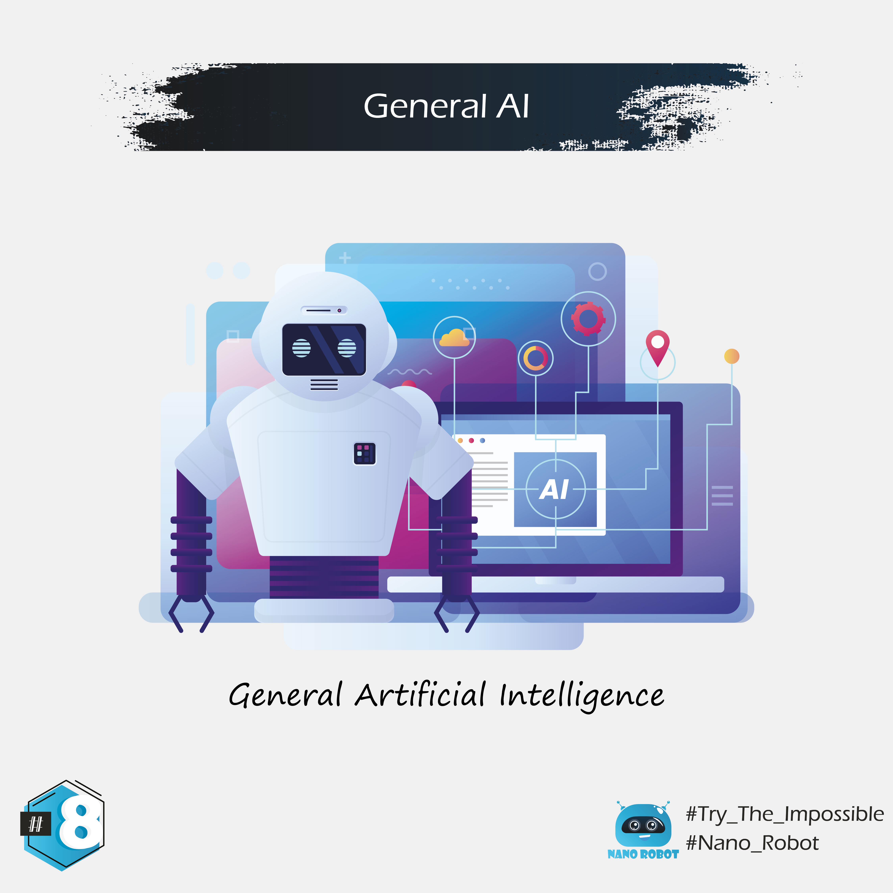

In the Turing test, a human judge has a conversation with another human and a machine. 
If the judge can't tell which is which, the AI has successfully passed the test. 
Passing the Turing test is one thing, but researchers have their sights set higher. 
They want to create AGI, which is short for artificial general intelligence.