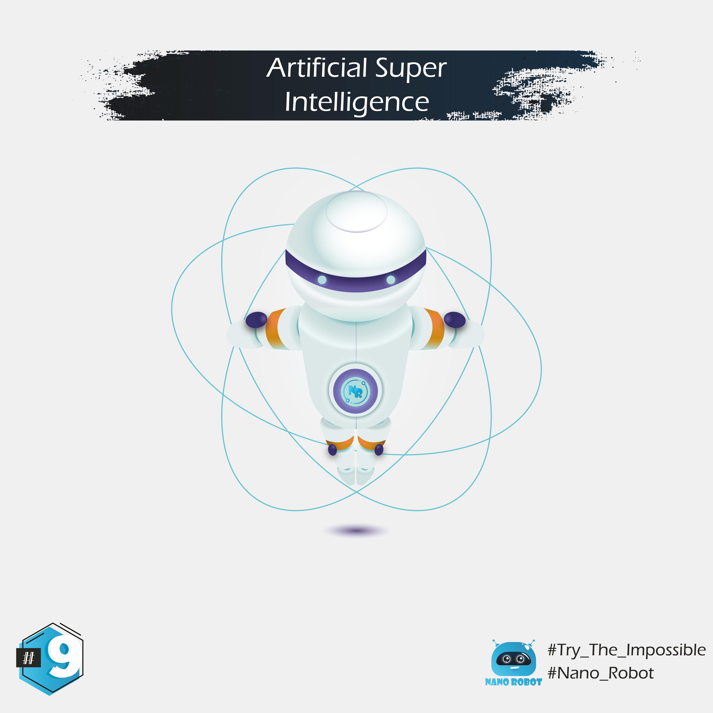

# English :

Once we figure out AGI, we'll be able to quickly move to the next step: ASI, or artificial super intelligence.
ASI is the one everyone is worried about since it would be something way smarter than most humans. We'll talk more about that later.

Big thanks to : @rzikidadda 🙏🏼 for his help in editing illustrations.

🚨 n.b : In case you preffer to read same slides in Darija (I recommand to try the experience with darija), just check it in the link below :

https://www.instagram.com/nanorobot_ma/ 
