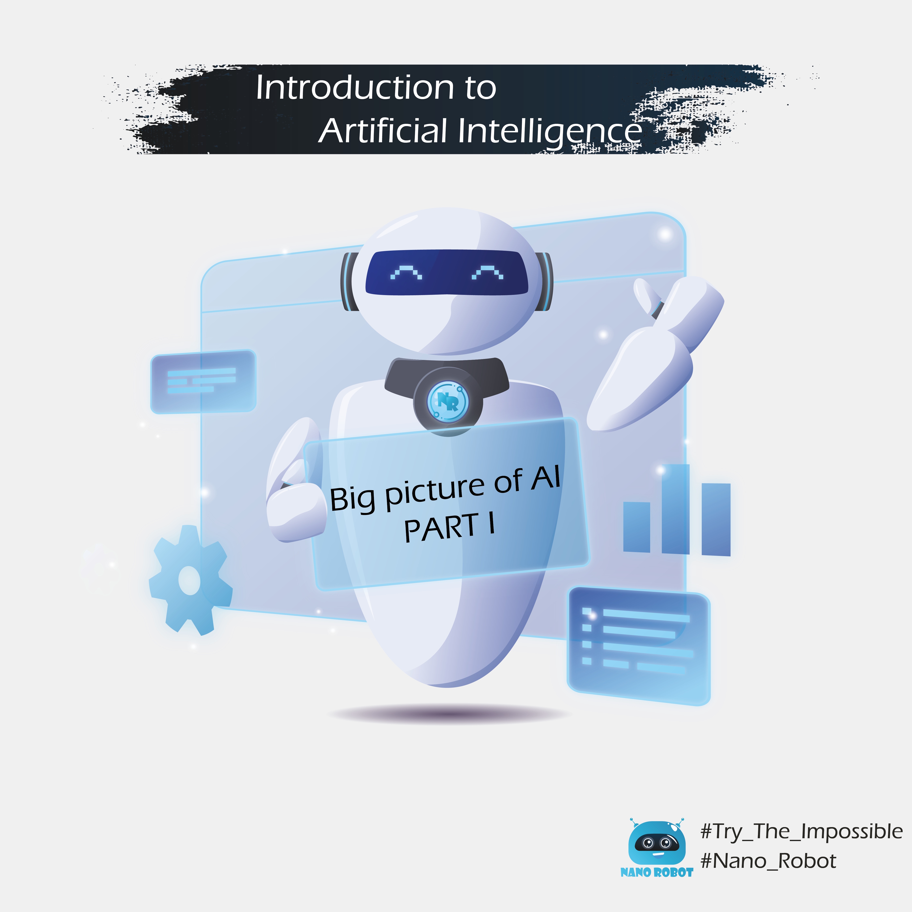
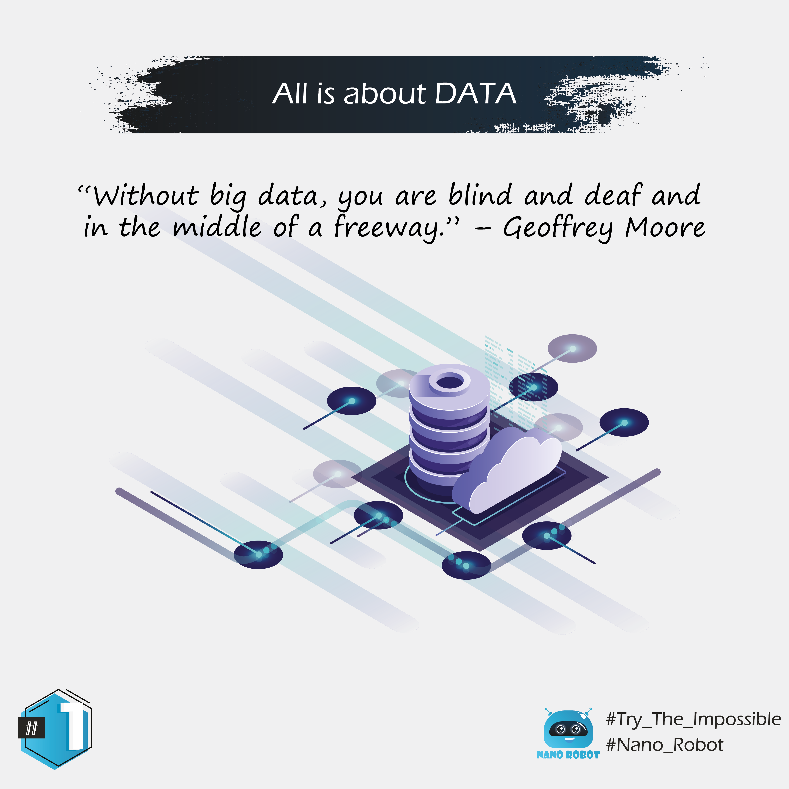
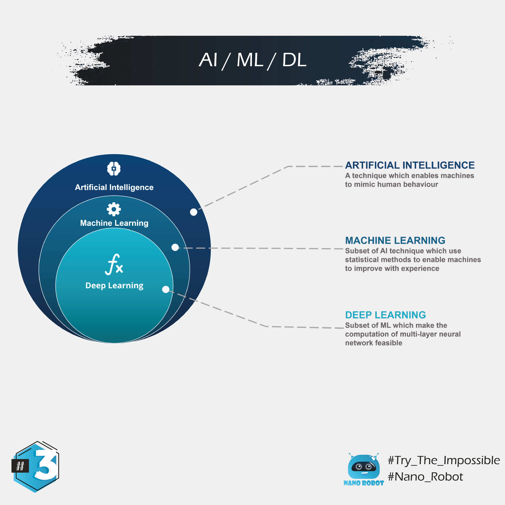
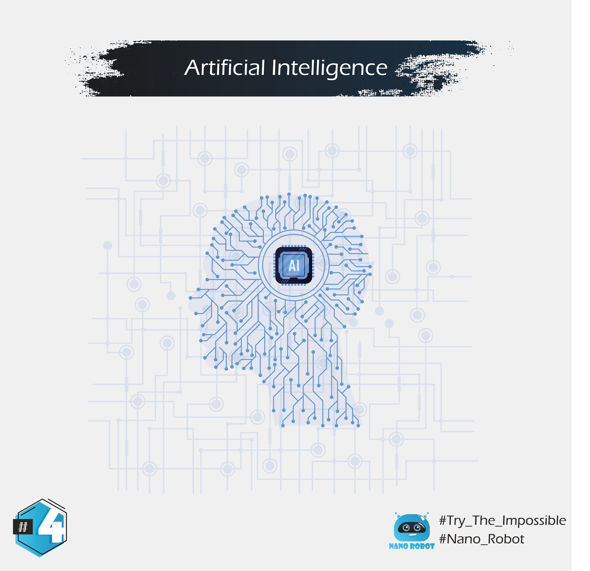

The #09 concept, is an idea in which I try to give a simplified explanation of the main notions in artificial intelligence and machine learning, in a somewhat superficial way. The division will be as follows:

[01#Big_Data]
[02#History]
[03#AI_ML_DL]
[04#AI]
[05#Machine_Learning]
[06#Deep_learning(Neural_Network)]
[07#Narrow_AI]
[08#AGI]
[09#ASI]

🚨 : In case you preffer to read same slides in Darija (I recommand to try the experience with darija), just check it in the link below :

https://www.instagram.com/nanorobot_ma/ 

## 01 - Big Data

The main ingredient or component of Every process, whether it is of a human or mechanical nature, requires the collection of the maximum amount of data or external information that would later enable the scientific passage in good conditions and to reach the goal in a smooth manner. So big data is an essential component of each component and alopecia that works with the property of artificial intelligence, because the more accurate data we present with a larger volume at the beginning of the process (entrances), the more accurate the outcome and the closer to the wap (exits).

## 02 - History of AI

As intimidating as it may seem, this technology isn’t new. Actually, for the past half-a-century, it’s been an idea ahead of its time.

The term “artificial intelligence” was first coined back in 1956 by Dartmouth professor John McCarthy. He called together a group of computer scientists and mathematicians to see if machines could learn like a young child does, using trial and error to develop formal reasoning. The project proposal says they’ll figure out how to make machines “use language, form abstractions and concepts, solve kinds of problems now reserved for humans, and improve themselves.” That was more than 60 years ago.

## 03 - AI / ML / DL

Artificial Intelligence / Machine Learning / Deep Learning

## 04 - Artificial Intelligence

In basic terms, AI is a broad area of computer science that makes machines seem like they have human intelligence.
So it’s not only programming a computer to drive a car by obeying traffic signals, but it’s when that program also learns to exhibit signs of human-like road rage.
So When we talk about intelligence, we're referring to the ability of gathering, processing and then applying knowledge.