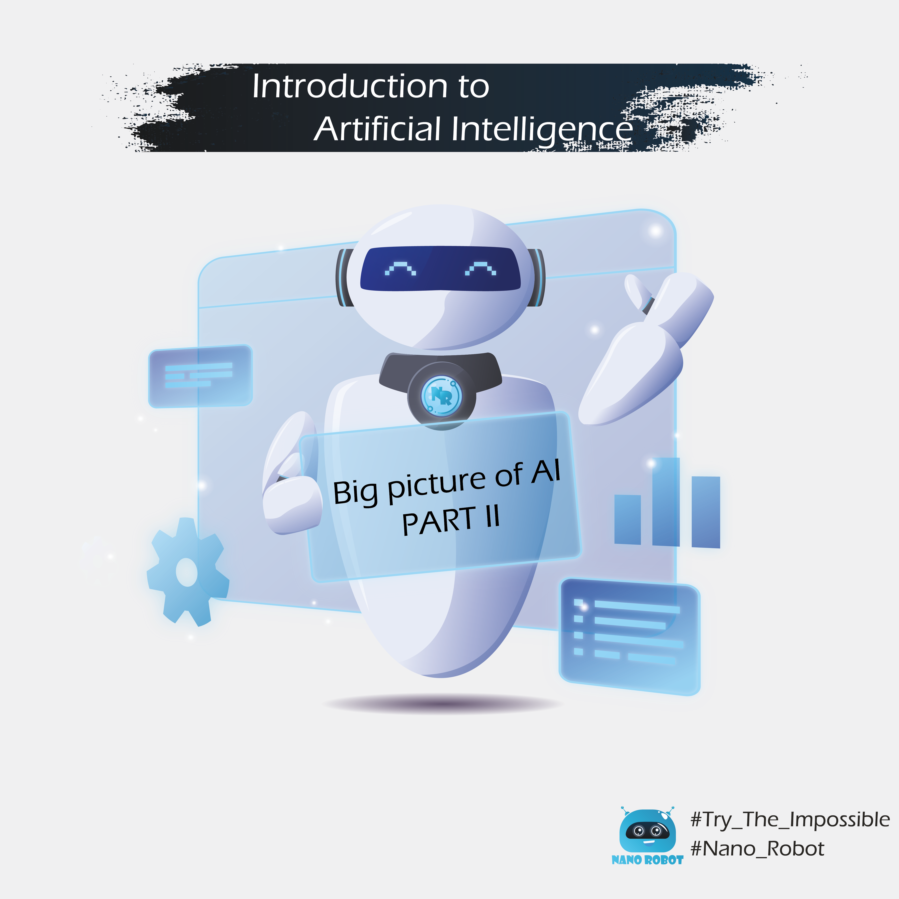
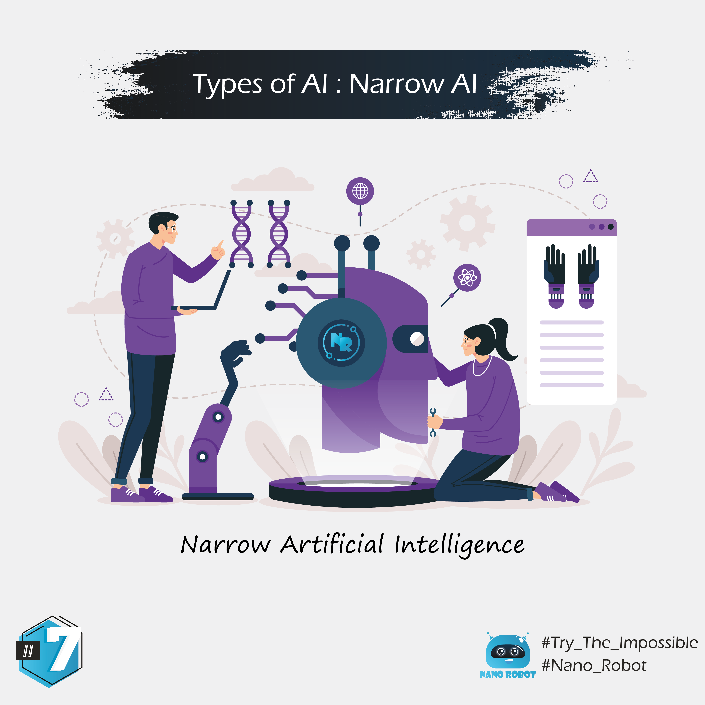
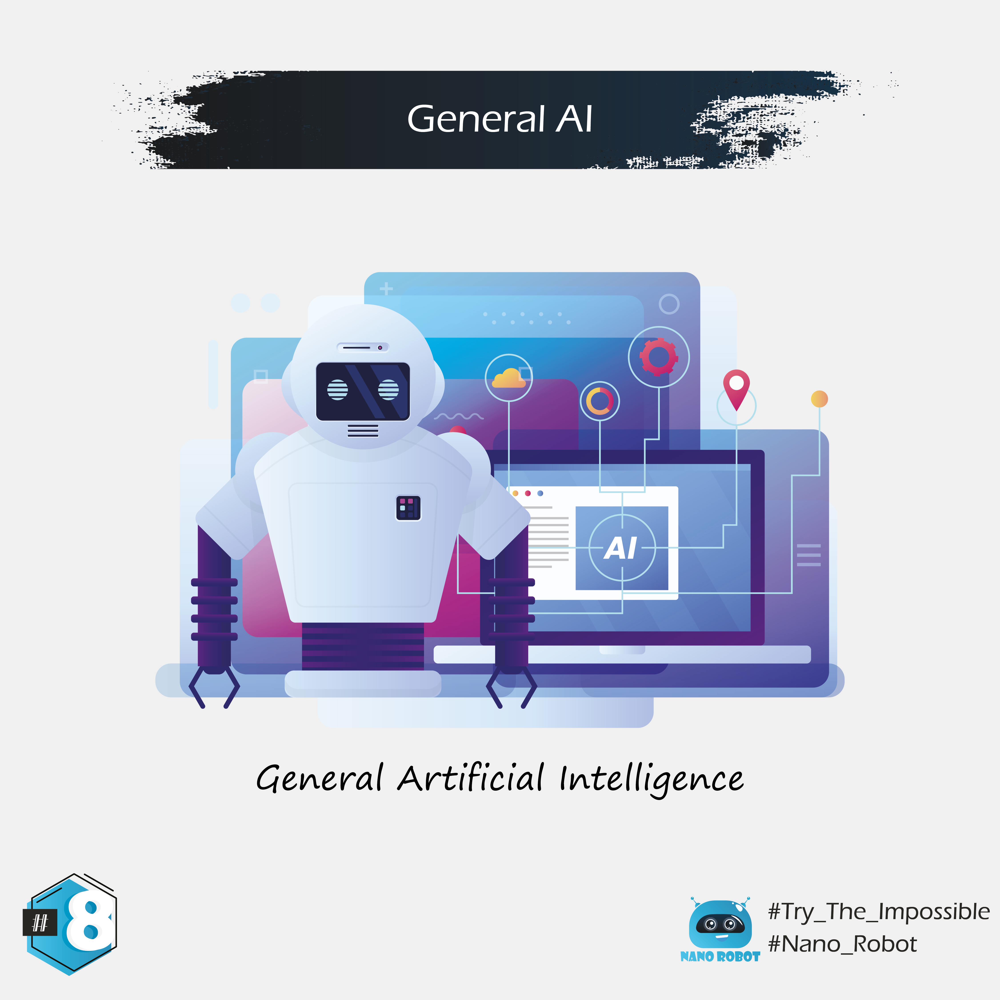
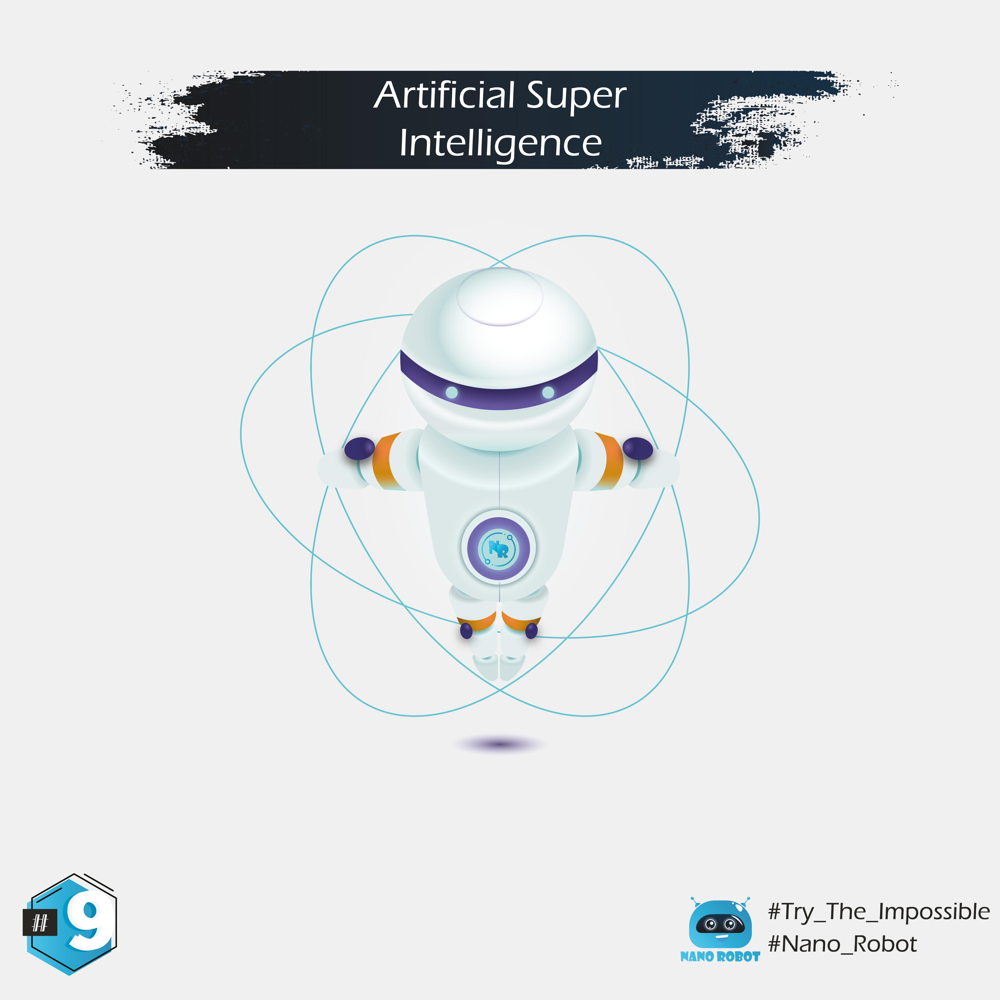

### FOLLOWING

## 05 - Machine Learning

Machine learning is basically making software that is able to learn how to do a task without us telling it how to do it.
It's different from normal software that only executes tasks a developer specified through code.
With machine learning, we can make software that learns how to write on its own.
It could then write totally new sentences, paragraphs, or even entire books, all on its own.

The simple version of machine learning is this: we give a machine a lot of data regarding a topic. Let's say images of cats.
After showing it hundreds, or even thousands of cats, we then give it a test. For example, asking it to name the animal in this picture.

## 06 - Deep Learning

Deep learning using neural networks to classify photos of Dogs and Cats

## 07 - Artificial Narrow Intelligence

The first and most basic form of AI is ANI, or artificial narrow intelligence.
It's called narrow because it can only perform tasks in specific, predefined contexts.
Narrow AI can do a task it was programmed to do incredibly well.
But it gets confused if you present it with new tasks that weren't previously defined and programmed.
Just because narrow AI is limited, doesn't mean it's not useful. Many companies use ANI chatbots for customer service. Some AIs are writers.

## 08 - Artificial General Intelligence

In the Turing test, a human judge has a conversation with another human and a machine. 
If the judge can't tell which is which, the AI has successfully passed the test. 
Passing the Turing test is one thing, but researchers have their sights set higher. 
They want to create AGI, which is short for artificial general intelligence.

## 09 - Artificial Super Intelligence

Once we figure out AGI, we'll be able to quickly move to the next step: ASI, or artificial super intelligence.
ASI is the one everyone is worried about since it would be something way smarter than most humans. We'll talk more about that later.

Big thanks to : @rzikidadda 🙏🏼 for his help in editing illustrations.

🚨 : In case you preffer to read same slides in Darija (I recommand to try the experience with darija), just check it in the link below :

https://www.instagram.com/nanorobot_ma/ 