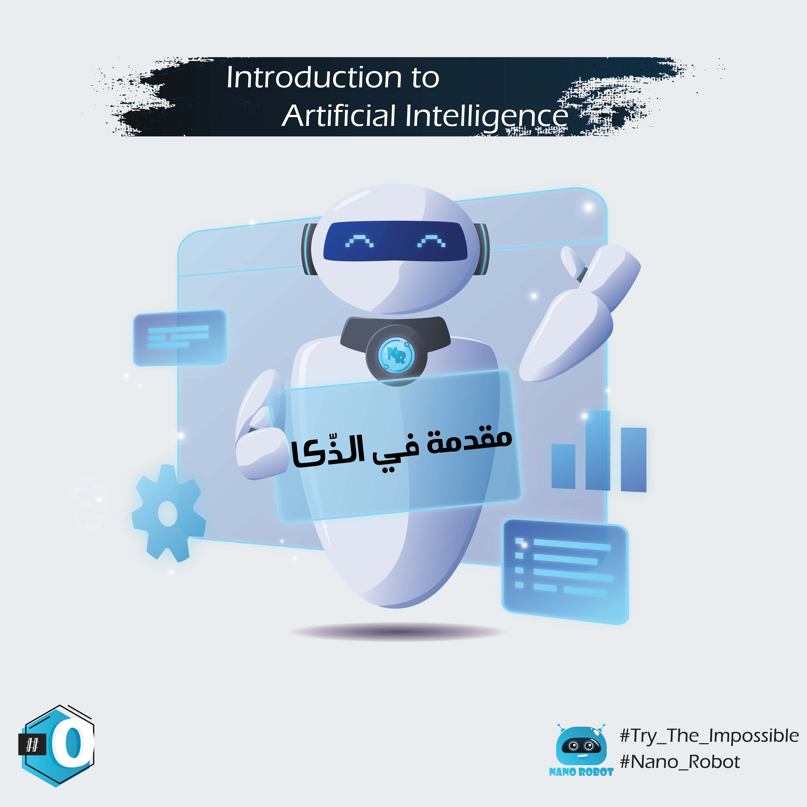

الكونسيبت #09, غدي ايكون واحد الكونسبيت لي كيعطي شرح مبسط لمفاهيم الذكاء الاصطناعي والتعلم الالي، وبصورة لي هي سطحية بعض الشئ؛ يعني بلا ديطاي احمادي. التقسيم ديال المحاور ايكون كالآتي :

## 01#Big_Data : المحور 1 
## 02#History : المحور 2 
## 03#AI_ML_DL : المحور 3 
## 04#AI : المحور 4 
## 05#Machine_Learning : المحور 5 
## 06#Deep_learning(Neural_Network) : المحور 6 
## 07#Narrow_AI : المحور 7 
## 08#AGI : المحور 8 
## 09#ASI : المحور 9 