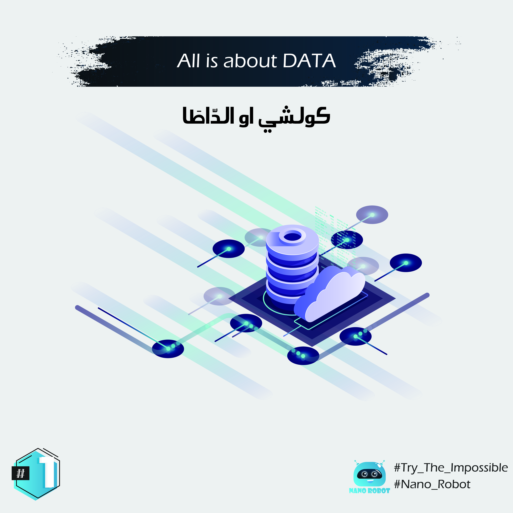

 

ممكن نقولو ان اهم حاجة فأي عملية اذا كانت متعلقة بينا حنا البشر او المشينة (الحواسيب🖥، الروبوتات🤖،...) ف المعلومات او المعطيات الخارجية كتبقي هي العنصر الاهم فاي عملية باش دوز فظروف جيدة او باش نوصولو فالغالب الهدف ديالنا 🎯 دقا دقا (على وزن المثال الشعبي : بالمهل كيتكال خودنجال). إذن الذَّكا 🧠 (الذكاء الاصطناعي) كيخدم بنفس اللوجيك قداش ما جمعنا بزاف ديال المعلومات (الدَّاطا) 📈 على هاداك المكون لي بغينا ندرسوا اولا نطبقوا عليه شي عملية (المداخل : زعما ديك الداطا الي كنعطيو لمشينة فالاول قبل ماتبدا العملية) قداشما غنربحوا فالاخير سواء بنتائج بشاااخ ألِيدام (جيدة) او قربية لدكشي لي كنى كنتسناو (لي هما المخارج : النتائج من بعد العملية). 

🚨بس : اللقطة ديال المداخل inputs و المخارج outputs حديو معاها مزال غنرجعوا ليها بزاف ديال المرات.

# English :

The main ingredient or component of Every process, whether it is of a human or mechanical nature, requires the collection of the maximum amount of data or external information that would later enable the scientific passage in good conditions and to reach the goal in a smooth manner. So big data is an essential component of each component and alopecia that works with the property of artificial intelligence, because the more accurate data we present with a larger volume at the beginning of the process (entrances), the more accurate the outcome and the closer to the wap (exits).
