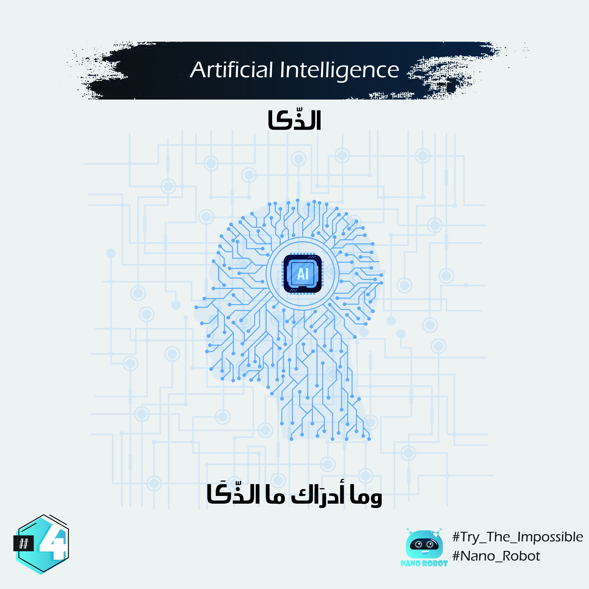

# English :

In basic terms, AI is a broad area of computer science that makes machines seem like they have human intelligence.
So it’s not only programming a computer to drive a car by obeying traffic signals, but it’s when that program also learns to exhibit signs of human-like road rage.
So When we talk about intelligence, we're referring to the ability of gathering, processing and then applying knowledge.

 

من اللخر الذّكا هو واحد الدوميين غابر او كبييرر، واهم حاجة فيه انه كيخلينا نشوفو الماشينية بحال شي بنادم من ناحية الذّكا والقدرة ديالها على التجاوب بطريقة تلقائية.
هاد الذّكا ماوقفش مثلا فالحد ديال اننا نطوروا واحد المشينة برمجيا باش تبقا كتحتارم اشارة المرور 🚦( هنا كنهدورا مثلا على الطوموبيلات ذاتية القيادة 🚎 لي بدات تتظهر فهاد الاونة الاخيرة فالسوق) مي هاد الذّكا هرب لواحد الحد اننا قدرنا نصنعو مشينة (روبوتات) كتبيّن قالتليك نعام اسيدي انها غضبانة😡، فرحانة🤩، جاها الملل😩، اوزيد ازيد بطريقة كتشبه الانسان. هدشي ممكن اجيك عادي ولكن لي معديش ان المشينة توصل واحد نيفو هارب عليك فالذّكا هنا (نود ابا التباري جمع حوايجك اوقصد لَعْدُو، منردهاش ليك ابا التباري). باش تفهم كثر البلان ديال ذكا هارب على ديال بنادم ابسط مثال نعطي مثلا شي معادلة رياضية صعيبة كاين فينا لي ميقدرش احلها بهاداك الذكاء لي عطاه الله مي كينين منصات فالانترنت لي كيحلو الاغلب ديال المعادلات الرياضية المعقدة مثلا كاين هاذا سميتو wolfram alpha.

بس : غا واحد البلان باش نتفقوا عليه الذَّكا ليك كنطورا راه كيبقا ذكاء اصطناعي وماكيناش شي حاجة ممكن تتفوق على ابداع الخالق (الدماغ البشري) مي راه الذكاء البشري كيبقا درجات كتختالف من شخص للاخر، غير هو لخوت لي كيخدموا على هاد الذكاء الاصطناعي راه كيكونو دارسين فيه بزااف ديال الاحتمالات الممكنة او لي الاساس ديالها كيف قلنا من قبل هي الدَّطا.

