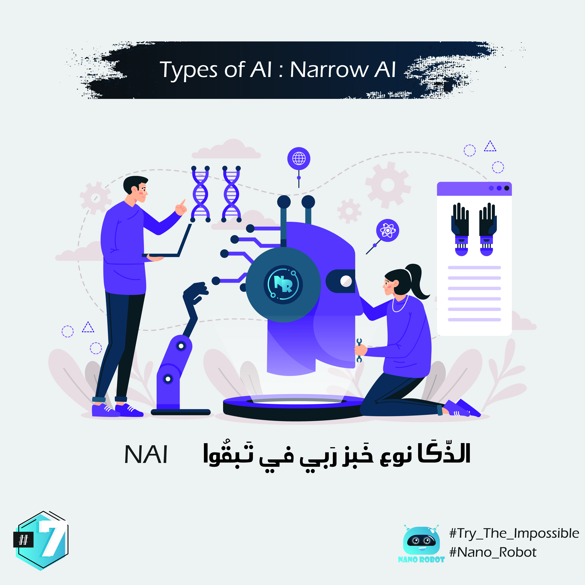

 

Narrow AI
هاذ النوع الاول من الذّكا ممكن تسميوه خبز ربي في طبقوا، حيتاش هو ذّكا ضيق، يعني مكيصدعش راسوا افكر بزاف، كقوليك انا كندير غا دكشي لي قلتيلي مان زيد مان نقص عليه. حيتاش ممكن اهرب ليه ريزوا الا طاح فشي حالة معقدة. المثال لي ممكن نعطي هنا هو مثلا عدنا واحد الروبوت المهمة ديالوا هي ايمشي لحدا الباب وإحل بالساروت 🔑 وايدخل، مي المشكل الي كان من النوع ديال خبز ربي في طبقوا او مشا حدا الباب او مالقاش الساروت 🔑❌ غيهرب ليه او مغيعرف ميدير (معندوش ديك ردت الفعل ايمشي اقلب على الساروت غا نية مسكين). مي هدشي مكيعنيش ان هاذ النوع معندوا فين اصلاح، فهو كستخدموه بزاف فالدومين ديال روبوتات الدردشة 🗣 (ديال قولها وعاود عليها) زعما بحال روبوت ديال قوقل google لي ممكن تهدر معاه او تعتيه اوامر انفذها (كنهدر على البدايات ديالوا، اما دابا قوقل طورات بزاف من الذّكا ديالوا او ولا كيَتْجَاوب بطريقة باااززز)

# English :

The first and most basic form of AI is ANI, or artificial narrow intelligence.
It's called narrow because it can only perform tasks in specific, predefined contexts.
Narrow AI can do a task it was programmed to do incredibly well.
But it gets confused if you present it with new tasks that weren't previously defined and programmed.
Just because narrow AI is limited, doesn't mean it's not useful. Many companies use ANI chatbots for customer service. Some AIs are writers.