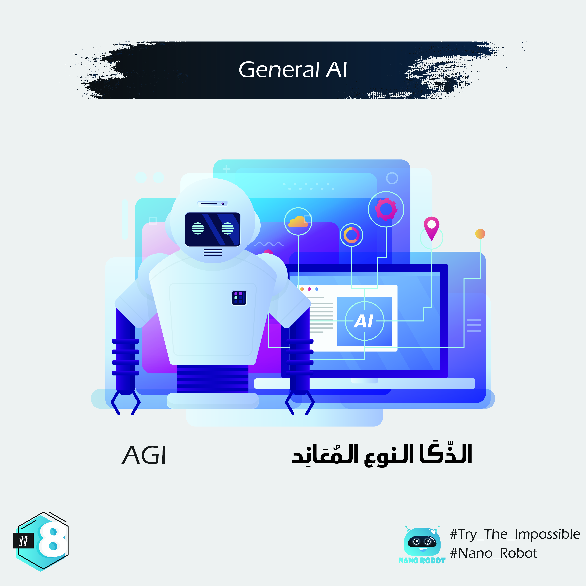

# English :

In the Turing test, a human judge has a conversation with another human and a machine. 
If the judge can't tell which is which, the AI has successfully passed the test. 
Passing the Turing test is one thing, but researchers have their sights set higher. 
They want to create AGI, which is short for artificial general intelligence.

 

AGI
هاذ النوع ديال الذّكا ممكن نسميوه المُعَانِد، الناس الى طورا هاذ النوع ديال الذكا حولوا ابتكروا شي حاجة مشابهة للبشر يعنى مغتقدرش تفرق بينوا او بين البشر . باش اجربوا هادشي داروا واحد طيسط ( test test 🎙الله الله) اختبار سماوه تورين طيسط( turing test) لي جربوا بيه ان واحد المشينة عندها هاد الذّكا غادي تهدر مع واحد الانسان، بحيث الا ماقدرناش نعرفوا نميزوا مابين شكون لي كيهدر واش المشينة ولا بنادم فآنذاك الطيسط غادييكون نجح او غادي نكونوا وصلنا لداك الذّكا المعاند لي بغينا.

