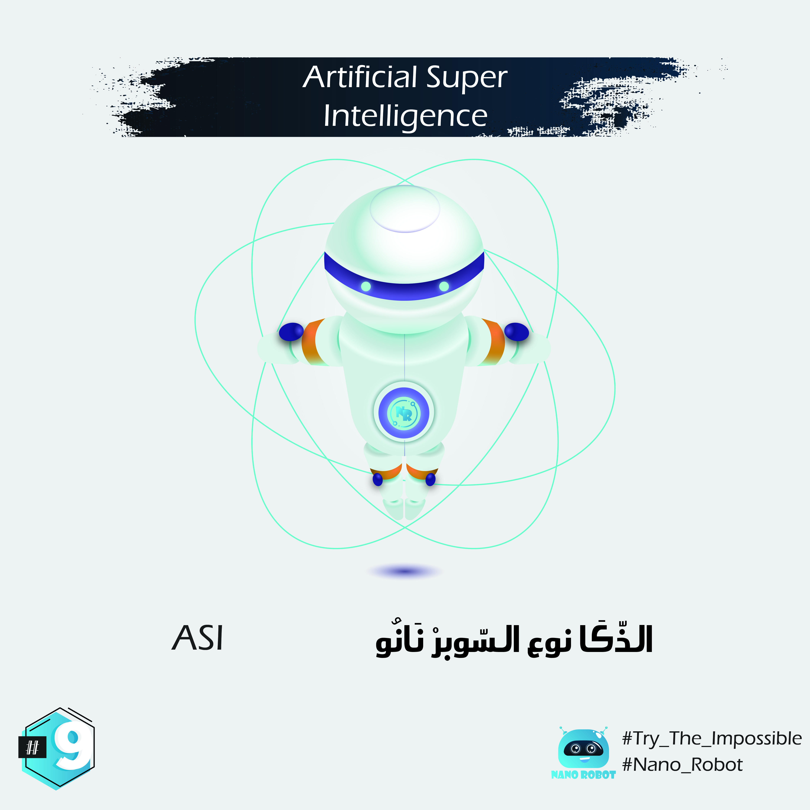

# English :

Once we figure out AGI, we'll be able to quickly move to the next step: ASI, or artificial super intelligence.
ASI is the one everyone is worried about since it would be something way smarter than most humans. We'll talk more about that later.

Big thanks to : @rzikidadda 🙏🏼 for his help in editing illustrations.

 

ASI
هاذ الذكا مهنا لقدام انسميوه سوبر نانو 🚀 ، فبمجرد ماقدرنا نطورا اوَلا نوصلوا لواحد الذّكا لي كيتعاند مع الذّكا ديال بنادم ( بحال دوك الالعاب ديال الذكاء بحال الشطرنج ♟ اودكشي بحيث كتلقا الخوارزميات ديال اللعبة كتتحدا الانسان او فبعض الاحيان كتفوق عليه فهنا مابقا مايتقال) يعنى وصلنا لواحد المرحلة ممكن نطورا واحد الذّكا لي يعلق على البشري وخليهوم فالتوش وعليه رفعت الاقلام وجفت الصحف.

وبهذا كتنتهي الحلقة اللولة من تسع صفحات فالتمهيد في الذّكا لي تنتما تكونوا ستافدتوا منها، او تكون فالتطلعات الي كنتوا تتنتضروا، بحيث حاولت نقدم احاطة شاملة لمفهوم الذكاء الاصطناعي من خلال مجموعة من الامثلة حيث الامثلة هي لي تتحاكي الواقع والتطبيق فالعلي ديال اي حاجة. الاقتراحات، التعليقات ديالكوم كتهمني بزاف باش المحتوى ازيد القدام وتعم الاستفادة و مترددش الا كانت عندك شي حاجة لي خاصها تتحسن.

