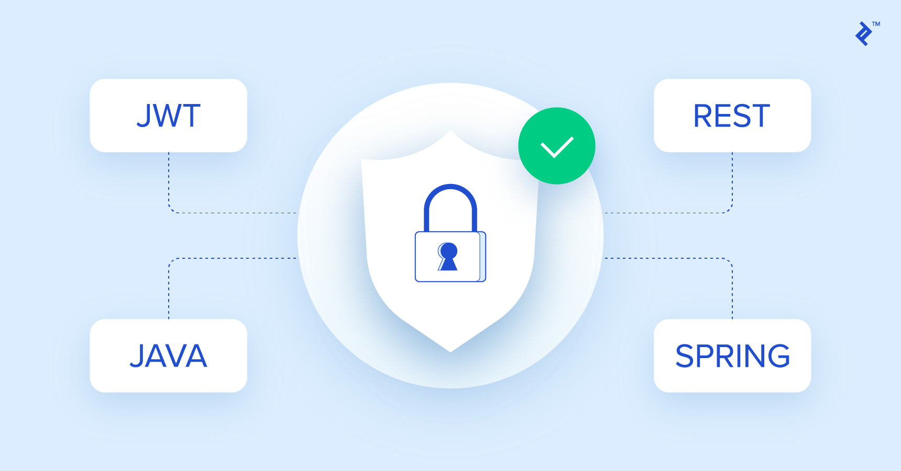
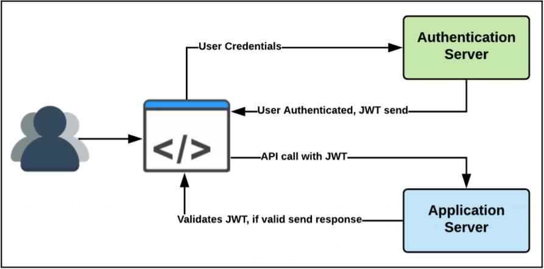
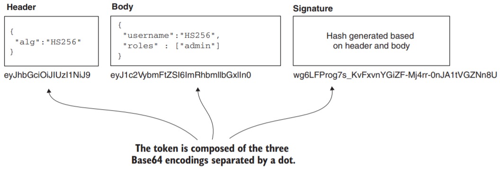
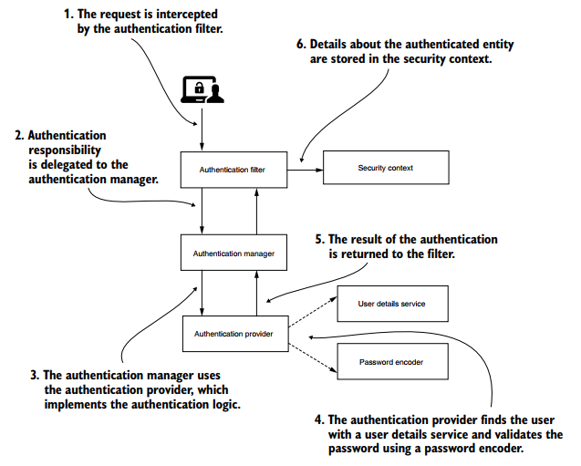

A few months, I had a discussion with a team colleague concerning securing Rest services in spring boot and the way to manage users Authentication/Authorization. The first thing that jumped to our conversation was the JWT method, and the operating mode of the filters within the architecture, I mean here ''AuthenticationFilter'' and ''Authorization Filter''.

Before we get into the implementation of JWT in the spring boot framework of java, let’s take a quick about the JWT concept and how it works to do authentication :

## Part 1: The JWT definition and structure

JSON Web Token (JWT) is an open standard (RFC 7519) wich transmitting information between parties as JSON object. 

In the past, the stateless nature of HTTP was circumvented in a web application by associating each request with a session ID created on the server and then stored by the client using cookies. Each request sends the cookie (session ID) in the form of an HTTP header, which gets validated by the server, and a state (a user session) is associated with each request. In modern applications, a server-side session ID is replaced with the JWT. The following diagram shows the workings of the JWT:

“JWT is used to carry information related to the identity and characteristics (claims) of the client bearing the token. This token is created during the authentication process and is verified by the authorization server before any processing. It is used by a resource server to allow a client to present a token representing its "identity card" to the resource server, and allows the resource server to verify the validity and integrity of the token in a stateless, secure manner” ‘’ Spring Security by Robert Winch Mick Knutson Peter Mularien ‘’
[Spring Security by Robert Winch Mick Knutson Peter Mularien](https://www.amazon.com/Spring-Security-applications-microservice-architectures/dp/1787129519)

Unlike common security mechanisms, such as encryption, obscuring, and hiding, the JWT doesn't encrypt or hide the data, but to ensure the authenticity of the data, also it’s a token-based stateless authentication mechanism, which is extremely useful in distributed systems and microservices architecture, using the Private-Public Key signing method.

## Part 2: Structure of JWT

The structure of the JWT consists of a header, payload, and a signature
  # JWT = header.payload.signature

## Part 3: Hello Spring Security

In the figure, we can see the main actors in the Spring Security architecture and the relationships among these. In the demo project, I will implement this architecture. But before we should explain the relationships among the entities that are part of the authentication and especially the part of filters and configuration class.

## Part 4: Show me the code 

So enough with the theory; let’s get down to some actual code. I have created a small project [demo project](https://github.com/miliariadnane/spring-boot-security-jwt) that showcases the signed JWT using spring boot with a client side using angular !