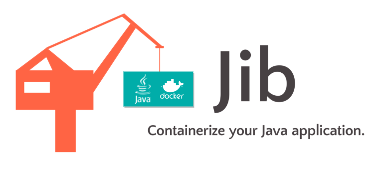
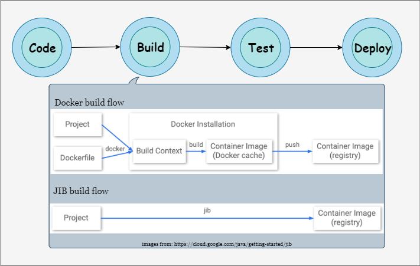
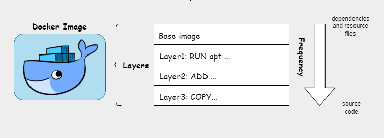

In this article, we will discover a magical Google plugin called [jib](https://cloud.google.com/java/getting-started/jib) that allows a speedy 🚀 build for our docker images for java application.

## What's Jib ?

[Jib](https://github.com/GoogleContainerTools/jib) is an open-source java tooling developed by Google’s team, it allows containerizing java applications with building docker and OCI images in a simple way. It does not require you to write a Dockerfile or have docker installed, and it is directly integrated into Maven and Gradle.

## How Jib works (workflow) ?

Within our development workflow, we can say that a task passes through 4 steps: <br/>
  - Code: this is about doing code by preparing a new feature or fixing a bug;
  - Build: The next step is about building our code to generate an artifact;
  - Test: Verify that the application is operating properly and that it meets our expectations;
  - Deploy: Deploy the artifact on a server and run the application;

JIB arrives at the building phase to handle all steps of packaging your application into a container image quickly and earning a lot of benefits in the process of development.



## Why Jib is powerful ?


Building docker images are not always an easy task, particularly in the Java ecosystem with JVM. The requirement includes some good knowledge of docker, how to write a docker file, running a docker daemon, and finally building and publishing the image to a registry.

For this reason, the jib compiler offers us a bunch of advantages that allows making a small, fast and secure image that we can deploy and scale in production easier without having docker in our machine, which means without writing any docker file or having a docker engine or docker daemon.

I can highlight the benefits of Jib in 2 main points: <br/>

  - **Support build automation tools like maven and Gradle**.
  - **Reproducible and Fast:** Jib mechanism does not need any docker file, but if we assume that jib needs a docker file, we can figure out how it works. Let's explain how with this illustration :



So jib in somehow understands our application, it works, and then it's split it into multiple layers. The plugin organizes the application into distinct layers; dependencies, resources, and classes. JIB put files that are less likely to change upwards such as dependencies and the resource file, and fastest far as that is more likely to change at the bottom, which is our source code.

> **To recap**, this mechanism utilizes Docker image layer caching to keep builds fast by only rebuilding changes and at the same time ensuring reproducibility; since if the code does not change, the generated image will be exactly the same.

## Usage


Containerize your Java apps Jib is an easy-peasy task in the blink of eye just by adding the Maven or Gradle plugin to your pom.xml file or build.gradle file too. 

Take a look around the Jib [maven plugin quickstart](https://github.com/GoogleContainerTools/jib/tree/master/jib-maven-plugin#quickstart) or whether you use Gradle, check the [link](https://github.com/GoogleContainerTools/jib/tree/master/jib-gradle-plugin#quickstart). We will be covering maven configuration in this blog post.

### Let's get started here.


1. Setting up Maven :

    <br>
    Foremost, let's add the maven configuration into pom.xml as below :

    ```xml	
    <project>
      ...
      <build>
        <plugins>
          ...
          <plugin>
            <groupId>com.google.cloud.tools</groupId>
            <artifactId>jib-maven-plugin</artifactId>
            <version>${jib.version}</version>
            <configuration>
              <from>
                <image>openjdk:11</image>
              </from>
              <to>
                <image>docker.io/username/${app.image.name}</image>
              </to>
            </configuration>
            <executions>
              <execution>
              …
              </execution>
            </executions>
          </plugin>
          ...
        </plugins>
      </build>
      ...
    </project>
    ```	

    > **from** tag allows configuring java (jdk) base image to build the application.
    By default, jib use java8 image, either if you want to change the version or the base image to build the project you can use the "from" tag and specify the version. For us, we have opted openjdk 11.
    
    <br>

    > **to** tag refers to target image that will push to container registry. In our case, we will use docker hub registry.

    <br>
2. Bind to a lifecycle (optional step) :

    <br>

      We can also bind jib to maven lifecycle, such as package, using <executions> tag, by adding the following execution to the plugin definition, as fellow: 

      ```xml	
      <plugin>
        <groupId>com.google.cloud.tools</groupId>
        <artifactId>jib-maven-plugin</artifactId>
        ...
        <executions>
          <execution>
            <phase>package</phase>
            <goals>
              <goal>build</goal>
            </goals>
          </execution>
        </executions>
      </plugin>
      ```	

    <br>

3. Settings credentials for registry

    <br>

    In order to push an image, we need to add registry credentials to [maven settings.xml](https://maven.apache.org/settings.html). It’s preferable to use maven password encryption to secure credentials of your registries, as mentioned [here](https://maven.apache.org/guides/mini/guide-encrypt.html).

    ```xml	
    <settings>
      ...
      <servers>
        ...
        <server>
          <id>docker.io</id>
          <username>miliariadnane</username>
          <password>{jSMOWnoPFgsrIt5iFQyJQ=}</password>
        </server>
      </servers>
    </settings>
    ```

    <br>

4. Build the image

    <br>

    The command **mvn compile jib:build**; build and push our image to our registry, in our case we have use docker hub registry.

    Note that the code must be compiled before the **jib:build** goal and the first execution may take a while, but the upcoming builds will be faster due to the layer caching as explained in fast benefit in the section "why jib is powerful ?" .

<br>

Next blog, we're going to delve deeper into jib, and we will try to containerize a spring boot application using this plugin.

## References :

- https://cloud.google.com/java/getting-started/jib
- https://github.com/GoogleContainerTools/jib
- https://medium.com/@mlniangpro/fast-java-dockerization-with-jib-5f41ef2209bd
- https://youtu.be/bkC1spGOI7Y