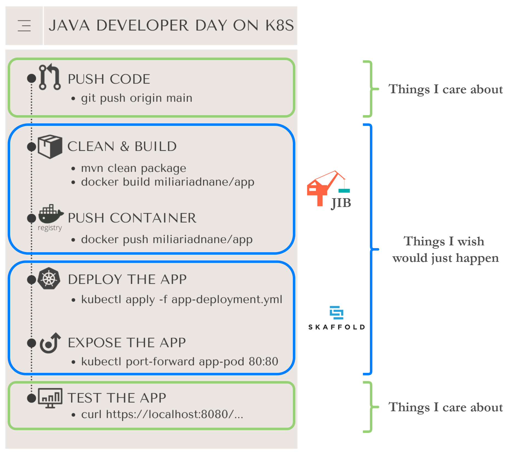

When it comes to native cloud applications, we notice that we spend much time on the workflow for building applications starting from the build of docker images, pushing them to the registers, until we deploy the application on Kubernetes and check if everything is functioning as intended. So when it comes to small changes, we end up with a bottleneck - for example, if we're running an app with multiple services, is in essence changing and starting each service of the 'X' number of services before you can make it all work.


## Skaffold

[Skaffold](https://skaffold.dev/) is a tool that has come to streamline the continuous development of our java application development workflow on k8s and save significant time for developers by automating most of the work through the deployment. Skaffold is an open-source and command-line project from Google, same as the jib plugin that we have highlighted in our last blogs, the two solutions are dedicated only for java applications.

In this post, I outline the main steps to set up Skaffold on a spring boot application to facilitate continuous development for k8s.

By default, Skaffold uses Dockerfiles while building an image with our application. When we hear that, we think directly about using jib for the same workflow. All those tools give a great power to speed up the development process. As we have already discovered about JIB and its benefits instead of building docker images without using Dockerfiles, we will take advantage of this for our Spring Boot App demo.

## Prerequisites !
Before we start, we need to install several tools. Of course, we also need to have a running Kubernetes cluster. We will use the following CLI tools:
1. Skaffold works great on Windows, MacOS and Linux too, this [link](https://skaffold.dev/docs/install/) describes the necessary steps for installation.
2. Docker (optional) - **note**: In our case, we will use Jib which does not require an installed docker engine. But if you're not using the jib, you need docker.
3. Kubectl (optional) - to interact with the Kubernetes cluster. It’s also used by Skaffold
4. Minikube (optional)

## Source code
If you’d like to try it by yourself, you can take a look at my source code on the [GitHub repository](https://github.com/miliariadnane/java-k8s-skaffold). Then you should just follow my instructions.


## Build and deploy the app on Kubernetes with Skaffold and jib
Before we get into the delays to configure Skaffold and the necessary to build and deploy the app on k8s, I prefer to demonstrate with a desmyfied illustration how we can automate the development process to save time, plus the benefit that the tool allows the developer to focus just on the business.



As shown in the figure, jib extension allows us to build the docker image and push it across registries without using Dockerfiles. Subsequently, skaffold takes care of everything concerning the update of k8s manifests and the redeployment of the application. So the developer has to deal only with the business part of the app and do tests after deployment.

# Step 1: Build the docker image using JIB plugin
As we have mentioned in the previous [post](https://miliari.me/blog/2022/jib/speed-up-your-java-app-image-build-using-jib), that jib doesn’t need to maintain any dockerfiles or even run a docker daemon. To use jib during our applicaiton build we just need to include the plugin to the maven or gradle file as shown below :

```xml
<build>
  <plugins>
    <plugin>
      <groupId>org.springframework.boot</groupId>
      <artifactId>spring-boot-maven-plugin</artifactId>
    </plugin>

    <plugin>
      <groupId>com.google.cloud.tools</groupId>
      <artifactId>jib-maven-plugin</artifactId>
      <version>2.7.0</version>
      <configuration>
        <to>
          <image>skaffold-springboot</image>
        </to>
      </configuration>
    </plugin>
  </plugins>
</build>
```
# Step 2: Create Spring Boot app
I have created a simple web application that exposes a REST API with a fake data store where I instantiate static data that return a list of persons (Kabour family members, It's a comedy series in Morocco).

# Step 3: Configure Skaffold
We must create a YAML file in the project root directory “skaffold.yml”, which contains our configuration, where we define the name of the generated docker image using jib.
```yaml
apiVersion: skaffold/v1beta15
kind: Config
build:
  artifacts:
    - image: skaffold-springboot
      jib: {}

deploy:
  kubectl:
    manifests:
      - k8s/*.yaml
```
The configuration file contains two main steps: **the build phase** where we tell skaffold where to generate the docker image and where to push it, and then  **the deployment phase** is about how to deploy the app on k8s.

# Step 4: Deploy on Kubernetes
To run our application in kubernetes we need to create a deployment object which will include the replicaset, and service of type Loadbalancer(LB).

Create a kubernetes folder under the root of your project, and within that create a deployment.yaml file with the below content :
```yaml
apiVersion: apps/v1
kind: Deployment
metadata:
  name: spring-springboot-app
spec:
  replicas: 3
  selector:
    matchLabels:
      app: spring-springboot-app
  template:
    metadata:
      labels:
        app: spring-springboot-app
    spec:
      containers:
        - name: spring-springboot-app
          image: spring-springboot
          ports:
            - containerPort: 8080
```	

Then we must create a load balancing service which will expose our application to the external world.
```yaml
apiVersion: v1
kind: Service
metadata:
  name: spring-springboot-app
spec:
  type: LoadBalancer
  ports:
    - port: 8081
      targetPort: 8080
      protocol: TCP
  selector:
    app: spring-springboot-app
```

Now, you can continuously develop, deploy and test your changes using the fellowing command:

> skaffold dev

To test the application in the browser, run the following command:
> skaffold dev --port-forward

Finally, you see the magic of skaffold in deployment of the app on k8s automatically, try to make some changes on the "FakeDataStore" class and see the changes reflected in the browser.

Cheers !

## References :

- https://skaffold.dev/
- https://cloud.google.com/blog/products/application-development/kubernetes-development-simplified-skaffold-is-now-ga
- https://medium.com/swlh/part-ii-spring-boot-app-development-with-skaffold-kustomize-and-jib-aa663e133558