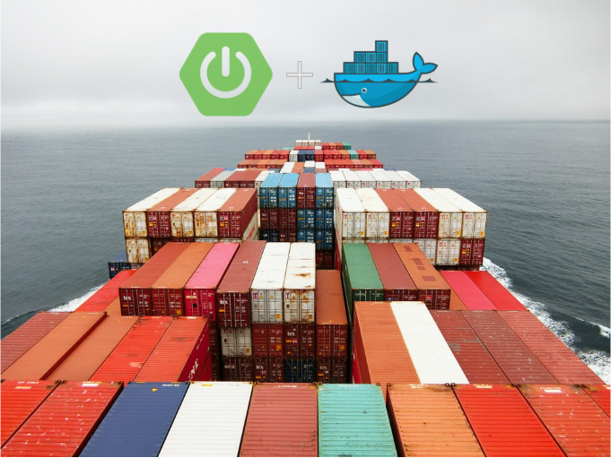
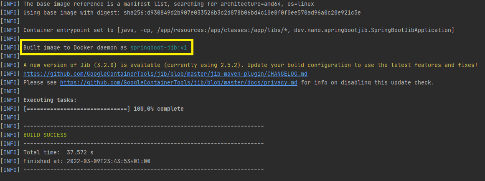
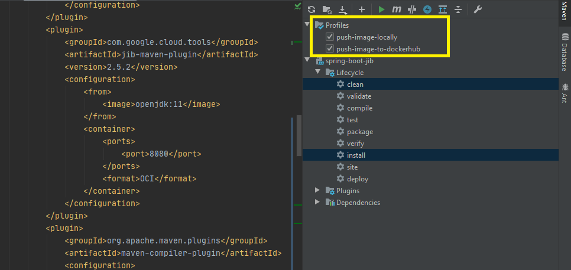
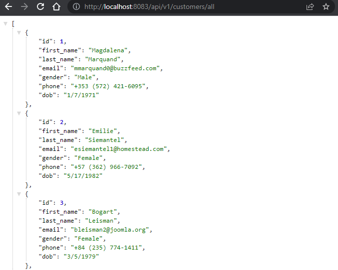

[unsplash photo by Rinson Chory](https://unsplash.com/photos/2vPGGOU-wLA)

Lately, I wrote a [post](https://miliari.me/blog/2022/jib/speed-up-your-java-app-image-build-using-jib) about the JIB plug-in! And how it's an enjoyable tool that helps automate the packaging of Java apps. So as a developer? you only care about the artifact and don't have to face the nonsense of docker (maintaining dockerfiles, etc).

In this post, I'll describe how easy to containerize spring boot application with JIB, all the steps will be using [maven-jib-plugin](https://github.com/GoogleContainerTools/jib/tree/master/jib-maven-plugin).

## Let’s dive into the real fun …

### I. Create a spring boot application

This can be done using spring [initializr](https://start.spring.io/), or your desired IDE. The source code of our spring boot application can be found on GitHub [here](https://github.com/miliariadnane/spring-boot-jib). It's just two APIs that print out a list of users; One shows the full list of users retrieved from a json file, and the other prints a filtered list with male users.

### II. Setting Up jib-maven-plugin in our "POM.xml"

First of all, let’s add the following additions to the properties section of the pom.xml file, in which we will need to specify the name of the image to be built as well as the version.

```xml
<properties>
  <app.image.name>springboot-jib</app.image.name>
  <app.image.tag/>
</properties>
```

Then we define **maven jib plugin** declarations in the build section using the <**plugins**><**/plugins**> tag. We can extend jib configuration with more configuration options for customizing the image build process :

```xml
<build>
  <plugins>
      <groupId>com.google.cloud.tools</groupId>
      <artifactId>jib-maven-plugin</artifactId>
      <version>2.5.2</version>
      <configuration>
        <from>
          <image>openjdk:11</image>
        </from>
        <container>
          <ports>
            <port>8080</port>
          </ports>
          <format>OCI</format>
        </container>
      </configuration>
    </plugin>
  </plugins>
</build>
```

The above configuration will build the application image with the following steps:

  1. Build the image from the base image openjdk:11 (pulled from Docker Hub)
  2. Expose the port 8080 from the container to the host (default port is 8080)
  3. Build the image as container image ([OCI format](https://github.com/opencontainers/image-spec))

The next step is to push the image to the container registry (docker hub) or locally using <**profile**><**/profile**> tag. Each profile can be used to push the image to different repositories.

### III. Push the image to the container registry (docker.io)

```xml
<profiles>
  <profile>
    <id>push-image-to-dockerhub</id>
    <activation>
      <activeByDefault>false</activeByDefault>
    </activation>
    <build>
      <plugins>
        <plugin>
          <groupId>com.google.cloud.tools</groupId>
          <artifactId>jib-maven-plugin</artifactId>
          <version>2.5.2</version>
          <configuration>
            <from>
              <image>openjdk:11</image>
            </from>
            <container>
              <ports>
                <port>8080</port>
              </ports>
              <format>OCI</format>
            </container>
          </configuration>
          <executions>
            <execution>
              <id>push-latest-tag</id>
              <phase>package</phase>
              <configuration>
                <to>
                  <image>docker.io/miliariadnane/${app.image.name}:latest</image>
                </to>
              </configuration>
              <goals>
                <goal>build</goal>
              </goals>
            </execution>
            <execution>
              <id>push-custom-tag</id>
              <phase>package</phase>
              <configuration>
                <to>
                  <image>docker.io/miliariadnane/${app.image.name}:${app.image.tag}</image>
                </to>
              </configuration>
              <goals>
                <goal>build</goal>
              </goals>
            </execution>
          </executions>
        </plugin>
      </plugins>
    </build>
  </profile>
</profiles>
```

> The above configuration specifies that we are going to push the image with two different tags, one is the latest version in the first <**execution**><**/execution**> tag with the ID "push-latest-tag", and the other one has a custom version, which we will specify in maven command later during the build of the image.

### IV. Push the image locally

```xml
<profiles>
  <profile>
    <id>push-image-locally</id>
    <activation>
      <activeByDefault>false</activeByDefault>
    </activation>
    <build>
      <plugins>
        <plugin>
          <groupId>com.google.cloud.tools</groupId>
          <artifactId>jib-maven-plugin</artifactId>
          <version>2.5.2</version>
          <configuration>
            <from>
              <image>openjdk:11</image>
            </from>
            <container>
              <ports>
                <port>8080</port>
              </ports>
              <format>OCI</format>
            </container>
          </configuration>
          <executions>
            <execution>
              <id>push-custom-tag</id>
              <phase>package</phase>
              <configuration>
                <to>
                  <image>miliariadnane/${app.image.name}:${app.image.tag}</image>
                </to>
              </configuration>
              <goals>
                <goal>dockerBuild</goal>
              </goals>
            </execution>
            <execution>
              <id>push-latest-tag</id>
              <phase>package</phase>
              <configuration>
                <to>
                  <image>miliariadnane/${app.image.name}:latest</image>
                </to>
              </configuration>
              <goals>
                <goal>dockerBuild</goal>
              </goals>
            </execution>
          </executions>
        </plugin>
      </plugins>
    </build>
  </profile>
<profiles>
```	

### V. Compile the app and build the image

Now we can build the image using the following commands:

* Maven command to push image to the local docker repository with a custom version:

> mvnw clean install jib:dockerBuild -Djib.to.image=springboot-jib:v1



* Maven command to push image to docker registry with a custom version:

**Note:** You should be authenticated to your container registry prior to building the image (docker login).

> mvnw clean install jib:build -Djib.to.image=miliariadnane/springboot-jib:v
1 -Djib.to.auth.username=miliariadnane -Djib.to.auth.password=🔑


> **Note:** To run without using jib commands, select your profile from the maven section and run "mvn clean install".



### VI. Run the image

We have successfully pushed the image to docker registry also in our local repository, and we can now run the image using docker:

> docker run --name springboot-jib -p 8083:8080 springboot-jib:v1

### VII. Test Application



Source code of GitHub repository can be found [here](https://github.com/miliariadnane/spring-boot-jib).

Cheers.