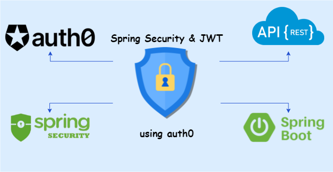
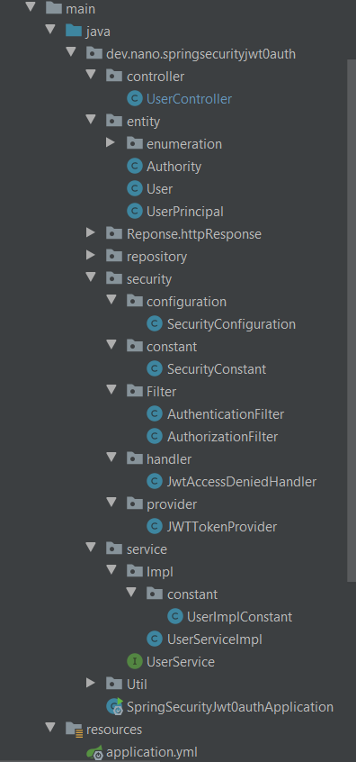
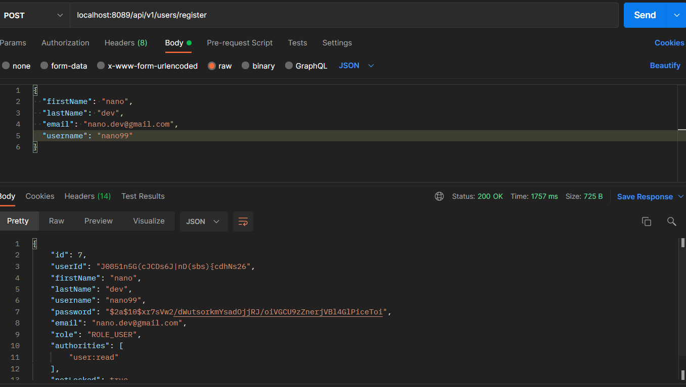
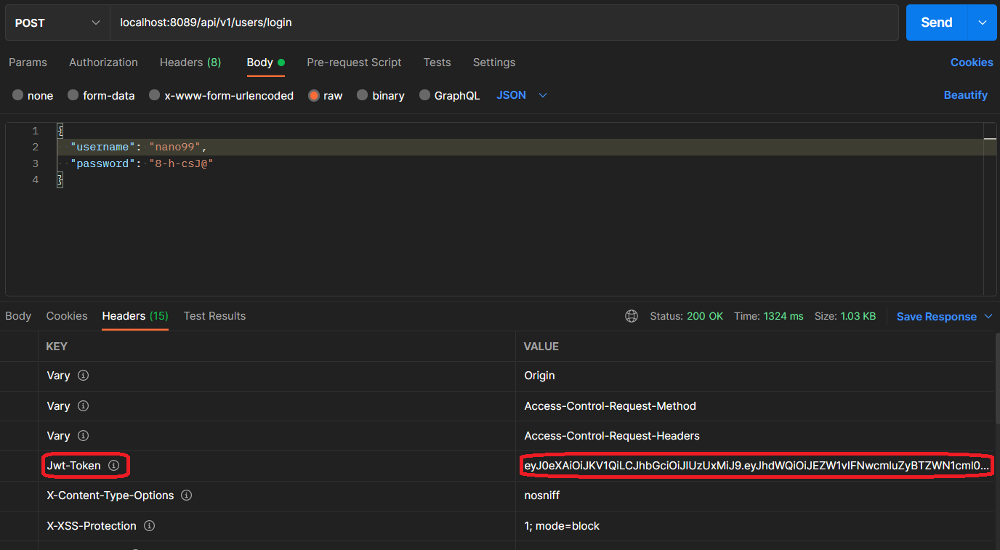
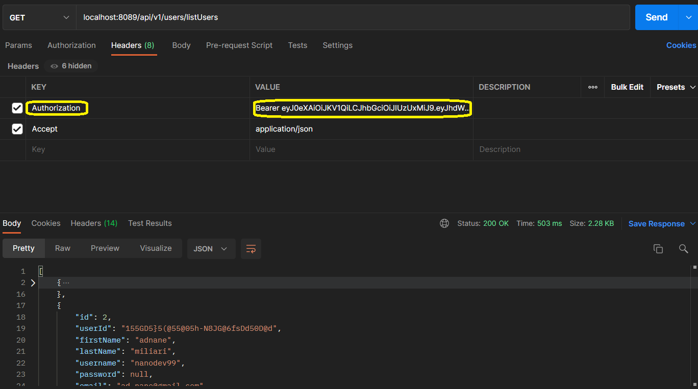
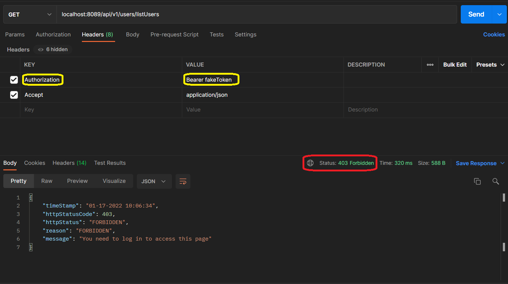

We have seen in the previous [post](https://miliari.me/blog/2021/spring-security-jwt/spring-security-token-authentication-using-jwt/) basic JWT concepts and how to implement and perform security layer in our Spring Boot Application. In this post, we will stay on the same topic of securing applications in spring boot but this time we are going to go through another method to generate and manipulate our JWT using dependency of [auth0](https://github.com/auth0/java-jwt).

> MUST READ: if you already have worked with JWT and you have knowledge about JWT and implementations, then keep reading. However, If you are new to JWT then try to check the previous post where we have through some basic theories regarding JWT and you will discover another implementation for this last using [jsonwebtoken.io](http://jsonwebtoken.io) dependency.

# Implementation :

For the implementation, we are going to use Spring Boot to take advantage from its automatic configuration and bootstrapping capabilities, and focus more on our core topic.

We can start looking at our project structure:


## 1. Maven configuration of jwt - auth0 :
```xml
<dependency>
    <groupId>com.auth0</groupId>
    <artifactId>java-jwt</artifactId>
    <version>3.18.2</version>
</dependency>
```

## 2. Security Configuration and filters
    
  First we’ll start by defining some constants that we’ll use throughout the implementation.
    
  ```java
    public class SecurityConstant {
      public static final long EXPIRATION_TIME = 604_800_000; // 7 days (one week) expressed in milliseconds
      public static final String TOKEN_PREFIX = "Bearer ";
      public static final String JWT_TOKEN_HEADER = "Jwt-Token"; // custom token header
      public static final String TOKEN_CANNOT_BE_VERIFIED = "Token cannot be verified";
      public static final String NANO_LLC = "Nano dev, LLC";
      public static final String NANO_SPRINGSECURITY_DEMO = "Demo Spring Security 0auth - Jwt";
      public static final String AUTHORITIES = "authorities"; // authorities of user
      public static final String FORBIDDEN_MESSAGE = "You need to log in to access this page";
      public static final String ACCESS_DENIED_MESSAGE = "You do not have permission to access this page";
      public static final String OPTIONS_HTTP_STATUS = "OPTIONS";
      public static final String TOKEN_SECRET = "[a-zA-Z0-9._]^+f7re87456rcdf987cr89df745fddsds45ds89";
      public static final String[] PUBLIC_URLS = {
              "/api/v1/users/login",
              "/api/v1/users/register"
      };
    }
  ```

  Here we can see a series of important data:

  ► EXPIRATION_TIME: Contains the time (in milliseconds) during which the token is valid before expiring. </br>
  ► JWT_TOKEN_HEADER: Contains the name of the header you are going to add the JWT to when doing a request. </br>
  ► TOKEN_PREFIX: Contains the prefix that you are going to add to the JWT when doing a request. </br>
  ► PUBLIC_URLS: Determines public endpoints to login and register the user. </br>
  ► TOKEN_SECRET: Contains the key to sign the token, and it has a length of 512 bytes because it‘ll be used by an algorithm that requires a string of at least that length. (Normally the key would be obtained from a secret and would never be hardcoded).

  Then, we need to create a SecurityConfiguration class and enable "@EnableWebSecurity" annotation, that will enable the web security configuration :

  ```java
  @Configuration
  @EnableWebSecurity
  @EnableGlobalMethodSecurity(prePostEnabled = true)
  @AllArgsConstructor
  public class SecurityConfiguration extends WebSecurityConfigurerAdapter {
    private AuthenticationFilter authenticationFilter;
    private AuthorizationFilter authorizationFilter;
    private JwtAccessDeniedHandler jwtAccessDeniedHandler;
    private UserDetailsService userDetailsService;
    private BCryptPasswordEncoder bCryptPasswordEncoder;

    @Override
    protected void configure(AuthenticationManagerBuilder auth) throws Exception {
        auth.userDetailsService(userDetailsService)
            .passwordEncoder(bCryptPasswordEncoder);
    }

    @Override
    protected void configure(HttpSecurity http) throws Exception {
        http.csrf().disable().cors().and()
                .sessionManagement().sessionCreationPolicy(STATELESS)
                .and().authorizeRequests().antMatchers(PUBLIC_URLS).permitAll()
                .anyRequest().authenticated() // any other request, user should be authenticated
                .and()
                .exceptionHandling().accessDeniedHandler(jwtAccessDeniedHandler)
                .authenticationEntryPoint(authenticationFilter)
                .and()
                .addFilterBefore(authorizationFilter, UsernamePasswordAuthenticationFilter.class);
    }

    @Bean
    @Override
    public AuthenticationManager authenticationManagerBean() throws Exception {
        return super.authenticationManagerBean();
    }
  }
  ```

  We have told spring to check authentication for our endpoints, in case there a request doesn’t exist the in list of authorized requests then an exception 403 (AccessDeniedHandler and ForbiddenEntryPoint) will be handled to the user using an ExceptionHandlingConfigurer.

  Furthermore, we have configured the authorization filter that plays a role in cerating a filter chain to extract the JWT token generate from the authorization header, validate the token, and set the authentication in a security context. ⇒ addFilterBefore(authorizationFilter, UsernamePasswordAuthenticationFilter.class)

  ```java
  @Component
  @AllArgsConstructor
  public class AuthorizationFilter extends OncePerRequestFilter {
    private JWTTokenProvider jwtTokenProvider;

    @Override
    protected void doFilterInternal(HttpServletRequest request, HttpServletResponse response, FilterChain filterChain) throws ServletException, IOException {
        if (request.getMethod().equalsIgnoreCase(OPTIONS_HTTP_STATUS)) {
            // check if request method is options (because opt it's send before any request
            // we should do nothing if req method is options
            response.setStatus(OK.value());
        } else {
            String authorizationHeader = request.getHeader(AUTHORIZATION);
            if (authorizationHeader == null || !authorizationHeader.startsWith(TOKEN_PREFIX)) {
                filterChain.doFilter(request, response);
                return;
            }

            // retrieve just the token by removing the bearer prefix
            String token = authorizationHeader.substring(TOKEN_PREFIX.length());
            String username = jwtTokenProvider.getSubject(token);

            if (jwtTokenProvider.isTokenValid(username, token)
                    && SecurityContextHolder.getContext().getAuthentication() == null)
            {
                List<GrantedAuthority> authorities = jwtTokenProvider.getAuthorities(token);
                Authentication authentication = jwtTokenProvider.getAuthentication(username, authorities, request);
                SecurityContextHolder.getContext().setAuthentication(authentication);
            } else {
                SecurityContextHolder.clearContext();
            }
        }
        filterChain.doFilter(request, response);
    }
  }
  ```

  Plus we have used the JwtTokenProvider, which has the following responsibilities: </br>
  1.  Verify the access token’s signature.
  2.  Extract the identity and authorization claims from the token then use them to create UserContext.
  3.  If our token is malformed, expired or simply if token is not signed with the appropriate signing key Authentication exception will be thrown.

  We can manage all these using the functionalities delivered by the JWT auth0 dependency. To see how we can use it, you can check the documentation [in the github repository link](https://github.com/auth0/java-jwt). Now we’ll create a JWTTokenProvider class:

  ```java
  @Component
  public class JWTTokenProvider {
    public String generateJwtToken(UserPrincipal userPrincipal) {
        String[] claims = getClaimsFromUser(userPrincipal);
        return JWT.create().withIssuer(NANO_LLC).withAudience(NANO_SPRINGSECURITY_DEMO)
                .withIssuedAt(new Date()).withSubject(userPrincipal.getUsername())
                .withArrayClaim(AUTHORITIES, claims).withExpiresAt(new Date(System.currentTimeMillis() + EXPIRATION_TIME))
                .sign(HMAC512(TOKEN_SECRET.getBytes()));
    }

    // permit to get authorities from the token
    public List<GrantedAuthority> getAuthorities(String token) {
        String[] claims = getClaimsFromToken(token);
        return stream(claims).map(SimpleGrantedAuthority::new).collect(Collectors.toList());
    }

    public Authentication getAuthentication(String username, List<GrantedAuthority> authorities, HttpServletRequest request) {
        UsernamePasswordAuthenticationToken userPasswordAuthToken = new
                UsernamePasswordAuthenticationToken(username, null, authorities);
        // set details of users in spring security details
        userPasswordAuthToken.setDetails(new WebAuthenticationDetailsSource().buildDetails(request));
        return userPasswordAuthToken;
    }
  ```
  
## 3. Testing the implementation 
  ### 3.1. Implement register API
  
  ```java
    @PostMapping("/register")
    public ResponseEntity<User> register(@RequestBody User user) {
        User newUser = userService.register(user.getFirstName(), user.getLastName(), user.getUsername(), user.getEmail());
        return new ResponseEntity<>(newUser, OK);
    }
  ```
  ### 3.2. Implement login API
  1. we authenticate the user, by the spring security authenticate method
  2. set the authentication in context
  3. get the user from DB
  4. Create JWT and send it in response

  ```java
  @Component
  public class JWTTokenProvider {
    public String generateJwtToken(UserPrincipal userPrincipal) {
        String[] claims = getClaimsFromUser(userPrincipal);
        return JWT.create().withIssuer(NANO_LLC).withAudience(NANO_SPRINGSECURITY_DEMO)
                .withIssuedAt(new Date()).withSubject(userPrincipal.getUsername())
                .withArrayClaim(AUTHORITIES, claims).withExpiresAt(new Date(System.currentTimeMillis() + EXPIRATION_TIME))
                .sign(HMAC512(TOKEN_SECRET.getBytes()));
    }

    // permit to get authorities from the token
    public List<GrantedAuthority> getAuthorities(String token) {
        String[] claims = getClaimsFromToken(token);
        return stream(claims).map(SimpleGrantedAuthority::new).collect(Collectors.toList());
    }

    public Authentication getAuthentication(String username, List<GrantedAuthority> authorities, HttpServletRequest request) {
        UsernamePasswordAuthenticationToken userPasswordAuthToken = new
                UsernamePasswordAuthenticationToken(username, null, authorities);
        // set details of users in spring security details
        userPasswordAuthToken.setDetails(new WebAuthenticationDetailsSource().buildDetails(request));
        return userPasswordAuthToken;
    }

    public boolean isTokenValid(String username, String token) {
        JWTVerifier verifier = getJWTVerifier();
        return StringUtils.isNotEmpty(username) && !isTokenExpired(verifier, token);
    }

    ...
  }
  ```
  ### 3.3. Test implementation of APIs

  To test the implementation, we are going to use Postman. First, we have to register a user. To do this, we’ll send the credentials (username & password) that the user will have in a POST, and they’ll be persisted in the database (postgres DB in our case).

  
  If everything went well we’ll receive an HTTP status 200 confirming that the credentials have been persisted. 
  
  Now we can try to log in. We are going to make a request to: “http://localhost:8089/api/v1/userslogin”, if the username and password are correct, we’ll get an HTTP status 200 response and the token generated by the server included in the headers with the key "Jwt-Token".
  

  So, now we can use the token to access the protected resources. In our case, we’ll try to access the endpoint "listUsers" -> “http://localhost:8089/api/v1/users/listUsers”. So to do that we should send our request, but in this respect, we have to add the token to the headers. For this, we’re going to put the word “Authorization” as key in headers and the token in the value prefixed with "Bearer ".
  
  If the token is correct, we will receive 200 response status with the protected.
  

  Otherwise, we will receive 403 (Forbidden) response status with the error message.
  

# Wrap up:

  Spring Security provides a security service for our spring application. It provides a way to authenticate users and to authorize access to resources using the JWT token that we can generate and manage by our server utilizing many dependencies, in our demo we've use jwt.io solution. Hopefully, this post can help in seeing the big picture of this sub-framework.

  Full source code can be found here: https://github.com/miliariadnane/spring-security-jwt-auth0

  If you have any suggestion, questions or remarks, please feel free to comment below.